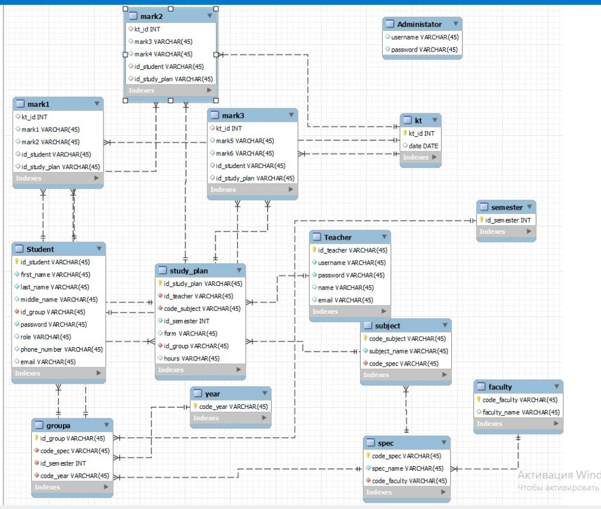
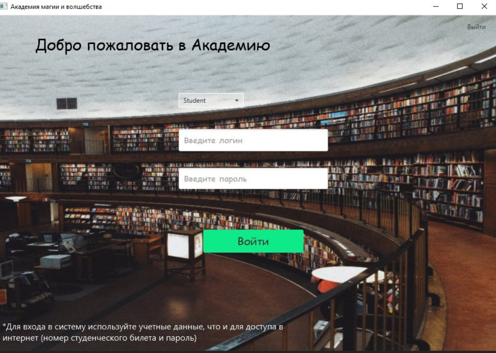
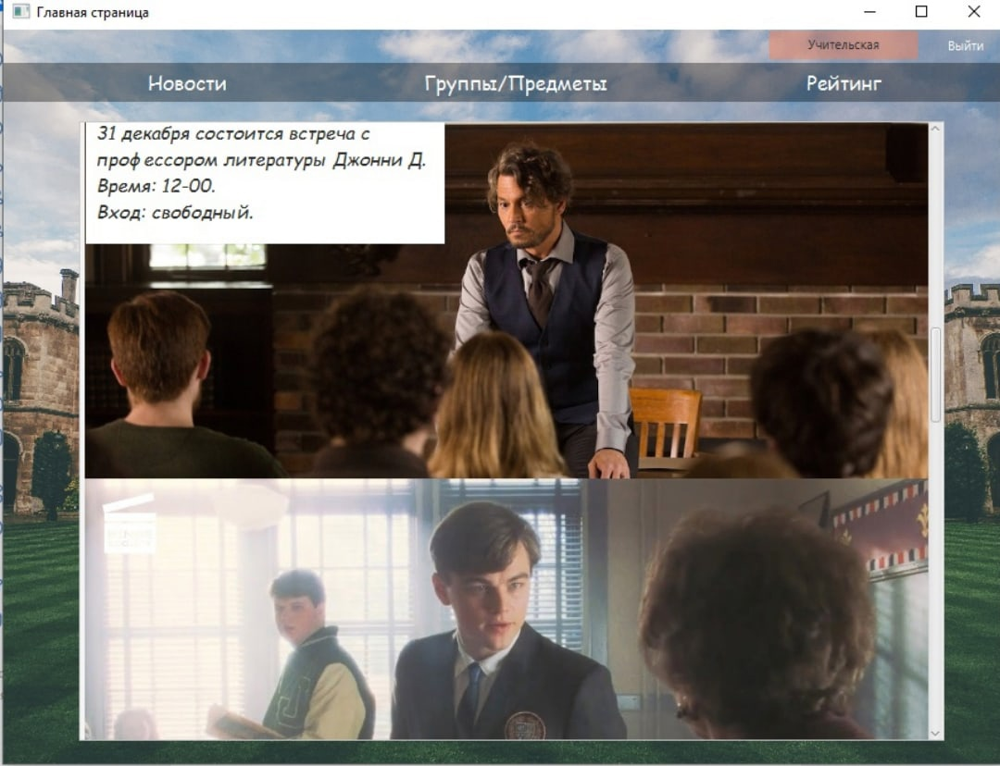
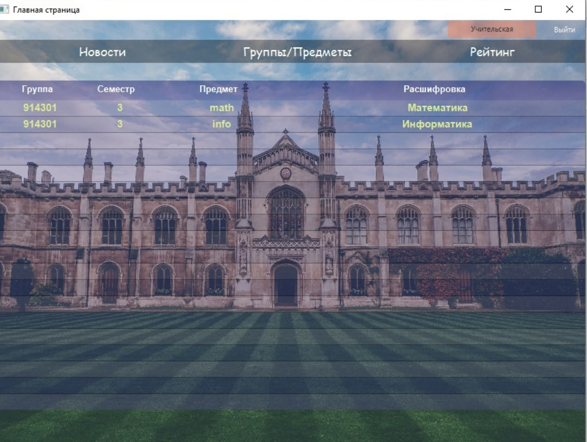
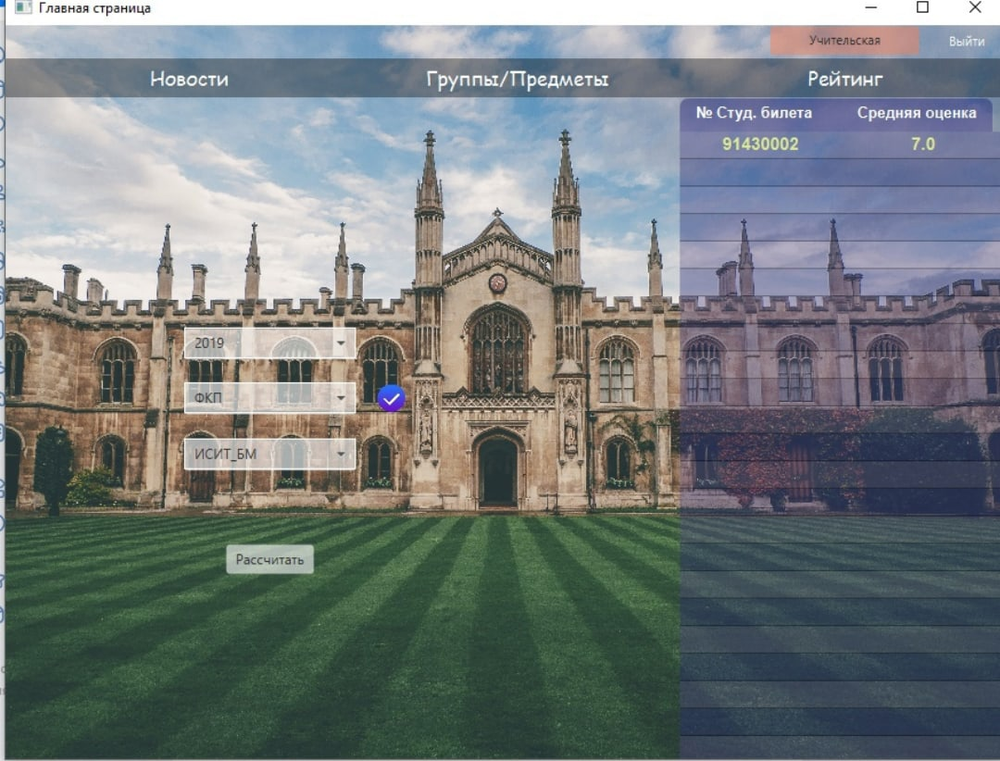
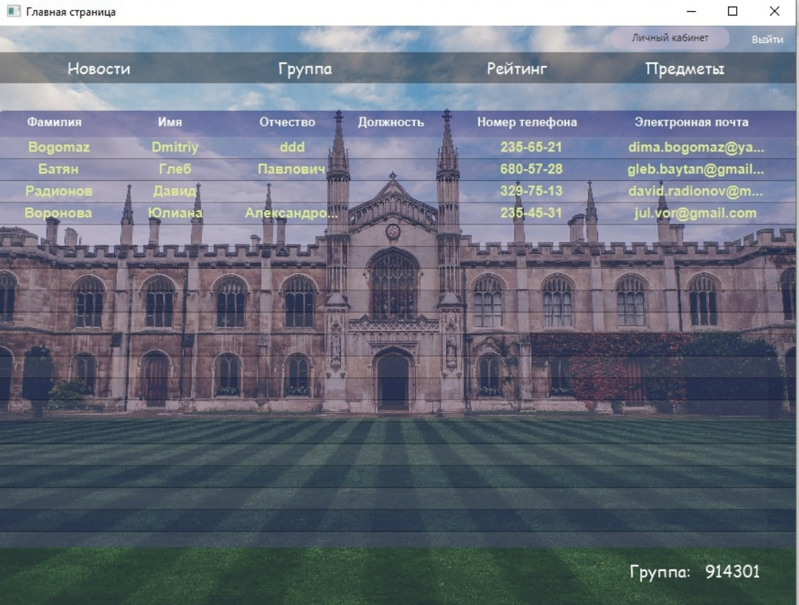
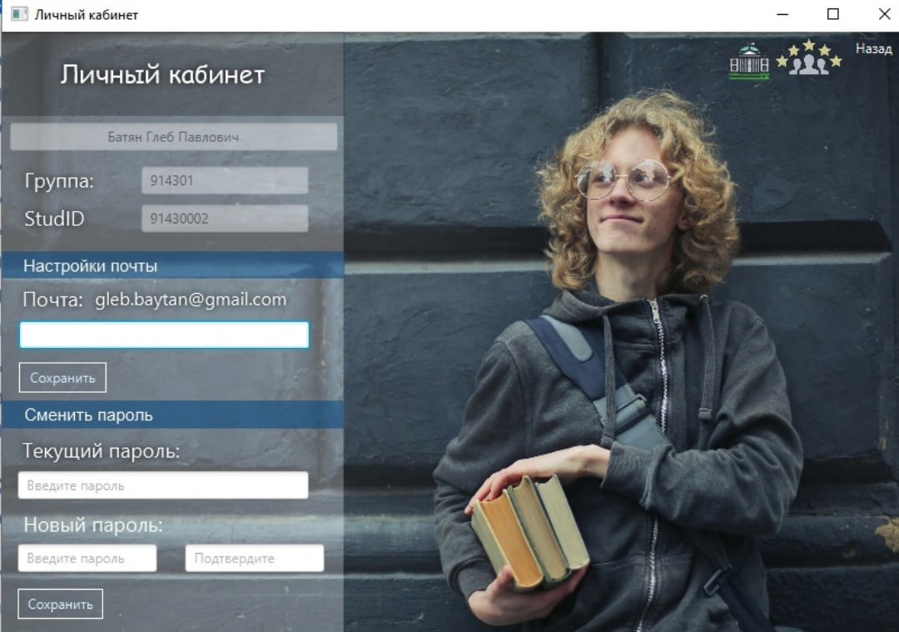
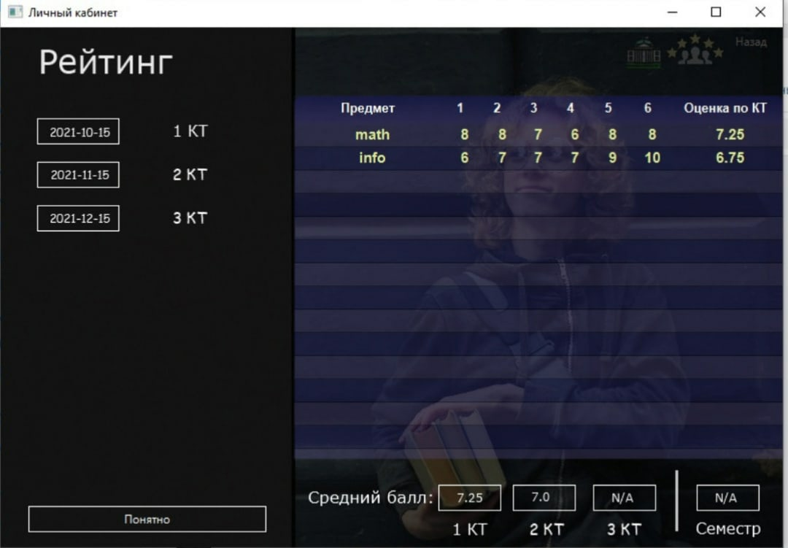

# Univerity-Rating-System
JavaFX client-server app (db: mysql). Authorization: administrator, student, teacher. 

Authorization Window

Teacher Main Page (University News)

Groups and subjects of a teacher

Student rating 

Teacher Cabinet

Student Main Page

Student Cabinet

Administrator Window

